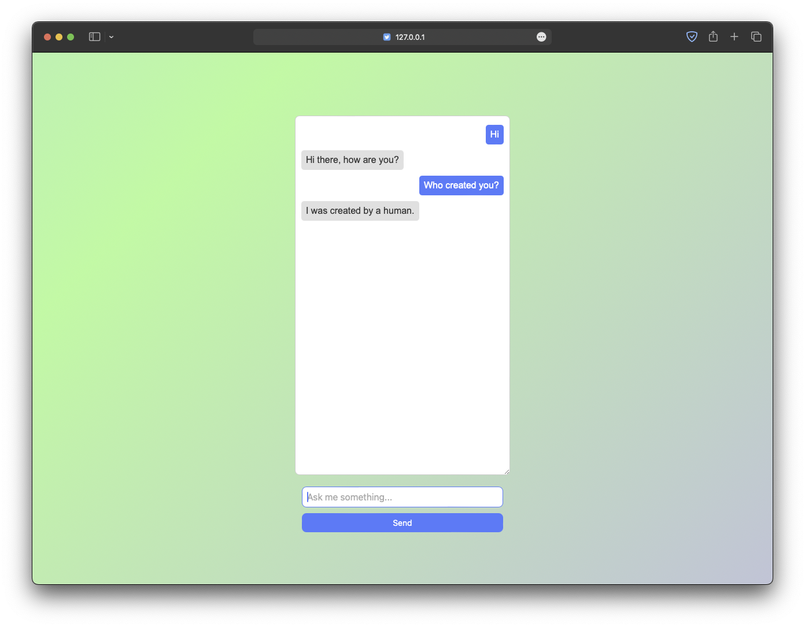

# Simple Python Chatbot

This is a simple python chatbot which uses json file to store the data. It uses TF-IDF (Term Frequency-Inverse Document Frequency) vectorizer and a Multinomial Naive Bayes classifier to classify the user input and give the response.

This project is under development and soon will be supported to web with multi modal support.

## Table of Contents

* [Demo](#demo)
    * [Demo Video](#demo-video)
    * [Screenshots](#screenshots)
* [Installation](#installation)
* [Usage](#usage)
    * [API](./example.md)
    * [Example Usage](#example-usage)
* [Features](#features)
* [Authors](#authors)

## Demo

### Demo Video

https://github.com/mantreshkhurana/simple-ml-python-chatbot/assets/120998049/8d3d7911-98b0-4d7f-88ab-437c691b194d

### Screenshots



## Installation

Use the package manager [pip](https://pip.pypa.io/en/stable/) to install the required packages.

```bash
pip install -r requirements.txt
```

or

```bash
pip3 install -r requirements.txt
```

## Usage

```bash
python train.py
python app.py
```

or

```bash
python3 train.py
python3 app.py
```

### Example Usage

A very basic implementation of API using Python `requests` library.

```python
import requests

url = "http://127.0.0.1:5000/api/chat"

if __name__ == "__main__":
    while True:
        input_data = str(input("Enter your question: "))
        data = {"question": input_data}
        response = requests.post(url, json=data)
        print("Bot:", response.json()["response"])
```

## Features

- [x] Text support
- [x] Custom response support
- [x] YouTube Search support
- [x] Google Search support
- [x] Wikipedia Search support
- [x] Google News support
- [x] Google Maps support
- [x] API support
- [ ] Conversation continuance support
- [ ] Image search support
- [ ] Translation support
- [ ] Image support
- [ ] Audio support
- [ ] Video support
- [ ] Muliple language support
- [ ] Markdown support
- [ ] Speech to text support
- [ ] Text to speech support
- [ ] Customizable

## Authors

* [Mantresh Khurana](https://github.com/mantreshkhurana)
